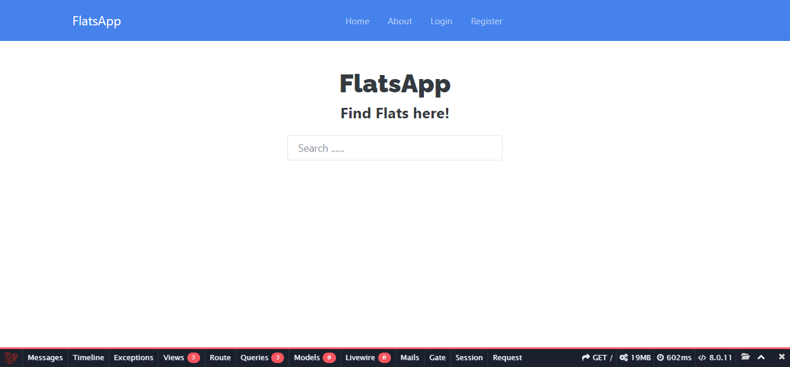

### The FlatsApp

This Application Stacks using `Laravel 8` with `MySQL`.

### Installation

To get up and running of this Application please make sure you already have :

-   <a href="https://www.php.net/">PHP</a>
-   <a href="https://www.mysql.com/">MySQL</a>
-   <a href="https://getcomposer.org/">Composer</a>
    installed on local machine

and if it so, first thing you have to do is Clone/download this repo by running this command on your terminal

`git clone https://github.com/ivandi1980/FlatsApp.git`

After successfuly clone, then run

`cd FlatsApp`
`composer install --ignore-platform-reqs -vvv`
`php artisan key:generate`

`Create Mysql Database`
`php artisan migrate`

`npm install && npm run dev`

`php artisan serve`

### ScreenShoot

